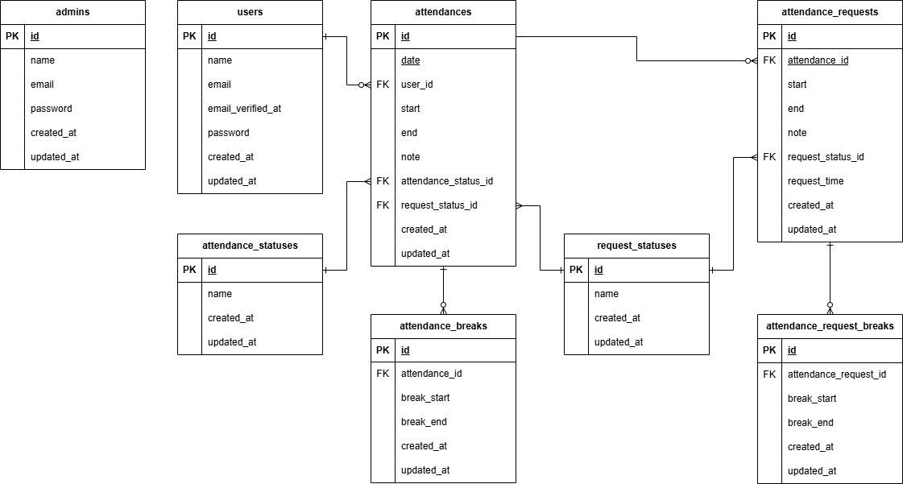
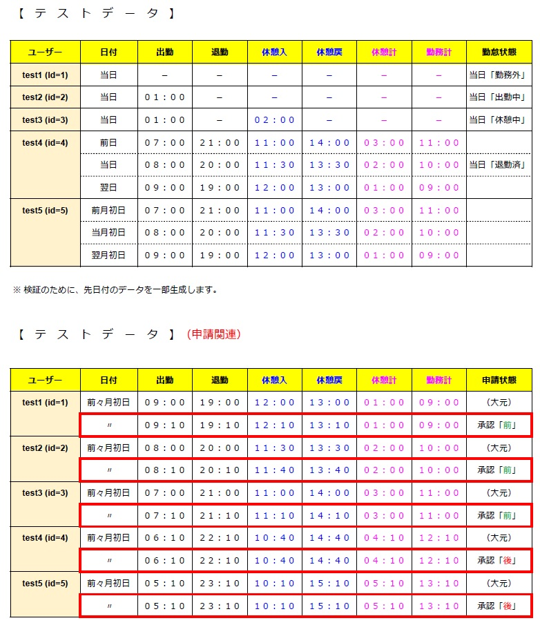

# 勤怠管理アプリ

## Dockerビルド
1. `git clone git@github.com:takayuki345/attendance.git`
2. DockerDesktopアプリを起動する
3. `docker compose up -d --build`

### Laravel環境構築
1. `docker compose exec php bash`
2. `composer install`
3. .env.exampleファイルから.envをコピー作成し、以下のように環境変数の値をメンテナンスする
``` text
DB_CONNECTION=mysql
DB_HOST=mysql
DB_PORT=3306
DB_DATABASE=laravel_db
DB_USERNAME=laravel_user
DB_PASSWORD=laravel_pass

        （中略）

MAIL_FROM_ADDRESS=no-reply@example.com
```
4. アプリケーションキーの作成
``` bash
php artisan key:generate
```
5. マイグレーションおよびシーディングの実行
``` bash
php artisan migrate --seed
```

## 使用技術（実行環境）
- php 7.4.9
- Laravel 8.83.29
- Mysql 8.0.26

## ER図


## URL
- 開発環境：http://localhost/
***（アクセス権の問題で`sudo chmod 777 -R src`が必要となる場合があります）***
- pypMyAdmin：http://localhost:8080/
- MailHog：http://localhost:8025/

## テスト
- 下記コマンドの実行により、テストデータの準備、設定キャッシュのクリア、テスト実行を行う。尚、テストデータの概要は下図を参照可能。

``` bash
php artisan migrate --seed --env=testing
php artisan config:clear

vendor/bin/phpunit tests/Feature/AttendanceTest.php
```


